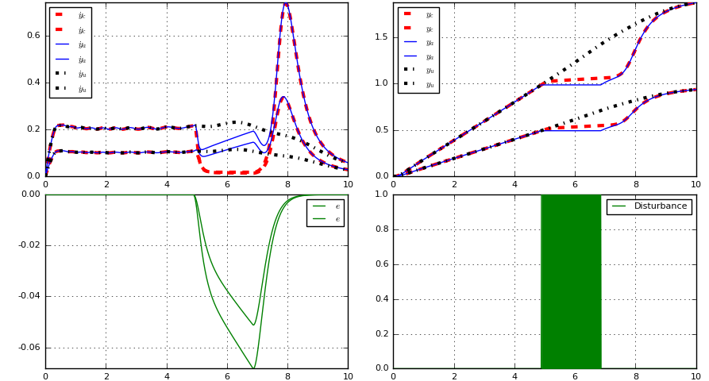

# DynamicMovementPrimitives

[](http://pkg.julialang.org/?pkg=DynamicMovementPrimitives)
[](https://travis-ci.org/baggepinnen/DynamicMovementPrimitives.jl)

Provides implementations of Ijspeert et al. 2013 and of Martin Karlsson, Fredrik Bagge Carlson, et al. 2017

## Installation

```julia
using Pkg; Pkg.add("DynamicMovementPrimitives")
using DynamicMovementPrimitives
```

## Usage
### Standard DMP
```julia
using DynamicMovementPrimitives
Nbasis  = 15
αz      = 25.
αx      = 1.
opts    = DMPopts(Nbasis,αx,αz)

y       = [zeros(10);LinRange(0,2,1000); 2ones(500)]
T       = length(y)
t       = LinRange(0,10,T)
h       = t[2]-t[1] # Sample interval
y       = [y 0.5y]
ẏ       = centraldiff(y) ./h # Differentiate position to get velocity
ÿ       = centraldiff(ẏ) ./h
dmp     = fit(y,ẏ,ÿ,t,opts)

tout,yout,ẏout,xout = solve(dmp,t) # Generate trajectory, see ?solve for options
plot(dmp) # Requires Plots.jl, plots the trajectory from solve with default options
plot(dmp,true)
```

### DMP with two degrees of freedom (Karlsson, Bagge Carlson et al. 2017)
This package also contains an implementation of
```bibtex
@inproceedings{karlsson2017dmp,
  title        = {Two-Degree-of-Freedom Control for Trajectory Tracking and Perturbation Recovery during Execution of Dynamical Movement Primitives},
  author       = {Karlsson, Martin and Bagge Carlson, Fredrik and Robertsson, Anders and Johansson, Rolf},
  booktitle    = {20th IFAC World Congress},
  year         = {2017},
}
```

We start by upgrading the DMP object to incorporate also the controller parameters for the 2DOF controller
```julia
dmp2opts = DMP2dofopts(kp = 25,kv = 10,kc = 10_000,αe = 5)
dmp2 = DMP2dof(dmp, dmp2opts) # Upgrade dmp to 2DOF version

t,yc,ẏc,x,ya,ẏa,e = solve(dmp2,t)
plot(dmp2) # Requires Plots.jl, plots the trajectory from solve with default options
plot(dmp2,true)
```

We test the performance of the 2DOF controller by implementing a solver callback. Between `t=2.5` and `t=4`, we stop the evolution of the physical system by setting `ẏa = 0` through `u[3] = uprev[3]`.
```julia
import OrdinaryDiffEq
condition(u,t,integrator) = 2.5 <= t < 4
affect!(integrator) = (integrator.u[3] = integrator.uprev[3])
cb = OrdinaryDiffEq.DiscreteCallback(condition,affect!)
```

We can call the solve method with our custom callback and plot the result. It should be clear from the figures that this time, the coupled signal `yc` slows down when there is a nonzero error.
```julia
t,yc,ẏc,x,ya,ẏa,e = solve(dmp2,t, solver=OrdinaryDiffEq.Euler(), callback=cb)
plot(t,ẏc, lab="\$ẏ_c\$", c=:red, l=(:dash, 3), layout=(2,2), subplot=1)
plot!(t,yc, lab="\$y_c\$", c=:red, l=(:dash, 3), subplot=2)
plot!(t,ẏa, lab="\$ẏ_a\$", c=:blue, subplot=1)
plot!(t,ya, lab="\$y_a\$", c=:blue, subplot=2)
plot!(t,e, lab="\$e\$", c=:green, subplot=3)
plot!(t,400 .<= 1:T .< 600, lab="Disturbance", c=:green, subplot=4, fillrange=0)
t,yc,ẏc,x,ya,ẏa,e = solve(dmp2,t)
plot!(t,ẏc, lab="\$ẏ_u\$", c=:black, l=(:dashdot, 3), subplot=1)
plot!(t,yc, lab="\$y_u\$", c=:black, l=(:dashdot, 3), subplot=2)
```
In the figure below, the black line represents the evolution with no disturbance, in the paper referred to as the unperturbed evolution. The blue evolution is the actual system evolution whereas the red curve displays the coupled system evolution.

